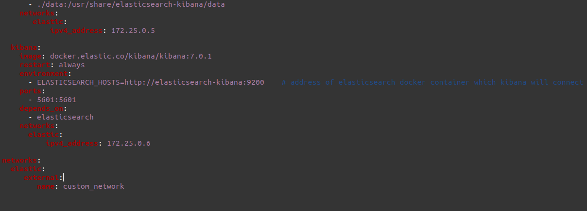
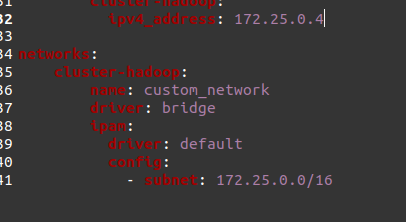

# Project-Big-Data

### Hướng dẫn cài đặt:

B1. Clone repo về.<br>
B2. Nếu chưa có cụm hadoop spark. Cài đặt docker và chạy cụm spark-hadoop theo link sau <a>https://github.com/longpt233/my-images </a> <br>
B3. ``` cd whoscored-project ``` <br>
B4. đóng gói ra file jar để chạy spark job: 
```
mvn clean package
```
B5. đưa file jar được đóng gói lên cụm chạy spark: example: <br>
```
docker cp ../Project-Big-Data/whoscored-project/target/whoscored-project-1.0-SNAPSHOT-jar-with-dependencies.jar hadoop-master:/opt/bitnami/spark
```
B6. Đưa file Data.csv lên các máy node chạy job:
```   
 docker cp {pathToData}/Data.csv hadoop-slave1:/ 
```

B7: submit spark-job:

```
 ./bin/spark-submit --master yarn --deploy-mode client --class bk.edu.first.FirstPush whoscored-project-1.0-SNAPSHOT-jar-with-dependencies.jar 
```

### Hướng dẫn cài đặt network giữa các container spark và elastic-search
Sửa networks file docker-compose.yml ở thư mục 102_elastic-search/es-kibana như sau:

Sửa networks file docker-compose.yml ở thử mục 005_spark-yarn như sau:

- <h3>Lưu ý
- Nếu container đã được chạy trước đó cần recreated lại container docker: 
```
docker-compose up -d --force-recreate
```
- Nếu container elastic search không chạy được(exit with code 78) cần chạy lệnh sau: </br>

    Ubuntu:
    ```
    sudo sysctl -w vm.max_map_count=262144
    ```
    Window:
    ```
    wsl -d docker-desktop
    sysctl -w vm.max_map_count=262144
    ```